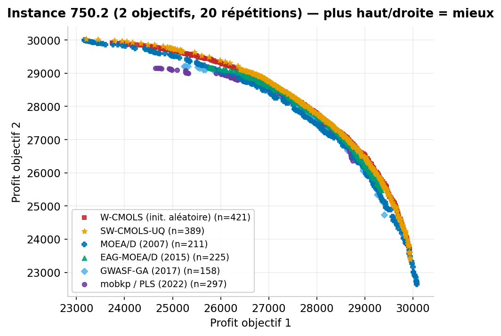
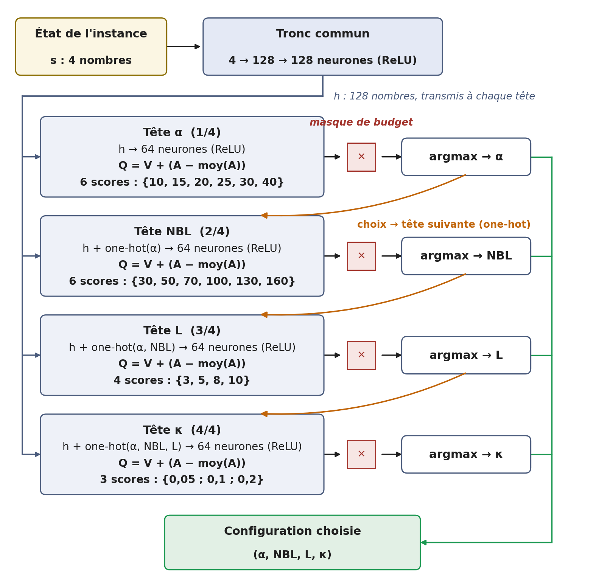

# Amorçage informé et configuration par instance de W-CMOLS

Code et résultats du mémoire de mastère *Utilisation des LLM et du DRL dans une approche fondée sur la
recherche locale pour résoudre le problème du sac à dos multi-objectif* (ENSI, LARIA, 2026).

Le point de départ est le solveur **W-CMOLS** (Ben Mansour, Basseur et Saubion, 2018), appliqué aux neuf
instances de Zitzler et Thiele (1999) : 250, 500 et 750 objets, 2, 3 et 4 objectifs.

- **Amorçage (SW-CMOLS)** : l'archive initialement vide est remplacée par un *cloud* de solutions :
  glouton (**G**), construit avec un modèle de langage (**L**), ou union des deux (**U**).
- **Configuration par instance (SW-CMOLS-Q)** : un agent DQN choisit les quatre paramètres (α, NBL, L, κ)
  avant chaque exécution, sous un budget de temps (**GQ**, **LQ**, **UQ**).
- **Validation** : oracle empirique, instance exclue de l'entraînement, ablation, SMAC3, et comparaison
  à treize algorithmes de la littérature.

## Organisation

```
demo.py               démonstration rapide (moins d'une minute)
paths.py, common.py   emplacements du dépôt ; instances, graines gloutonnes, voisins, solveur, hypervolume
data/instances/       neuf instances (format Zitzler-Thiele) et fichiers de vecteurs de poids de W-CMOLS
data/reference/       bornes de normalisation de l'hypervolume et références de W-CMOLS, par instance
solver/               W-CMOLS en Cython (moacp_noreinj : solveur de tous les résultats rapportés)
hypervolume/          calcul de l'hypervolume normalisé
dqn_agent/            agent DQN : réseau autorégressif à têtes Dueling, masque de budget, environnement
seeding/              construction et évaluation des clouds G, L, U ; prompts et décisions du LLM (llm/)
configuration/        modèle de coût, entraînement et évaluation de l'agent
validation/           oracle empirique, SMAC3, temps remesurés le même jour, synthèse
comparison/           comparaison aux concurrents, indicateur epsilon ; lanceurs des concurrents (competitors/)
figures/              scripts des figures ; figures produites (images/)
clouds/               greedy_<inst>, llm_<inst>, union_<inst>, llm_ablation_<inst> (L sans les décisions du LLM)
models/               politiques entraînées (policy_*), modèles de coût, budgets, trace de décision
results/              résultats des campagnes (JSON) et synthèses (Markdown)
results/fronts/       fronts de Pareto de W-CMOLS et de nos variantes
competitor_fronts/    fronts de Pareto des treize concurrents
```

## Installation

Python 3.12.

```bash
pip install -r requirements.txt
cd solver && python setup.py build_ext --inplace     # nécessite un compilateur C (MSVC, gcc ou clang)
```

Sous Windows avec Python 3.12, sans compilateur : télécharger `solver_windows_python312.zip` depuis la page
*Releases* et décompresser ses deux fichiers dans `solver/` (ils sont compilés à partir des sources de ce dossier).

## Démarrage rapide

```bash
python demo.py            # instance 250.2, 3 répétitions ; ou par exemple : python demo.py 500.4 2
```

Le script exécute W-CMOLS, puis W-CMOLS amorcé par le cloud union, puis la configuration choisie par
l'agent DQN, et vérifie que chaque hypervolume est identique au résultat publié dans `results/`.

## Scripts et résultats

| Étude | Script | Résultat |
|:---|:---|:---|
| Nombre de directions du cloud L | `seeding/screen_direction_count.py` | `results/screening/` |
| W-CMOLS et variantes amorcées G, L, U | `seeding/evaluate_seeded_solver.py` | `results/{wcmols,seeded_greedy,seeded_llm,seeded_union}_<inst>.json` |
| Effet propre des décisions du LLM | `seeding/evaluate_seeded_solver.py ctrl`, `seeding/llm_effect_test.py` | `results/seeded_llm_ablation_*`, `results/llm_effect_summary.md` |
| Modèle de coût | `configuration/fit_cost_model.py`, `configuration/calibrate_cost_model.py` | `models/cost_model_*.json` |
| Variantes configurées GQ, LQ, UQ | `configuration/train_agent.py`, `configuration/evaluate_agent.py` | `results/agent_*_budget0.8.json`, `results/agent_results_summary.md` |
| Politique appliquée sans cloud | `configuration/evaluate_agent.py WQ` | `results/agent_no_cloud_budget0.8.json` |
| Choix du facteur de budget | `configuration/evaluate_agent.py` (10 répétitions) | `results/agent_union_budget*_screening.json` |
| Écart à l'oracle empirique | `validation/oracle_gap.py` | `results/validation/oracle_*.json` |
| Instance exclue de l'entraînement | `configuration/train_agent.py --exclude`, `evaluate_agent.py` | `results/agent_union_leave_one_out_budget0.8.json` |
| Ablation Dueling / rejeu priorisé | `configuration/train_agent.py --no-dueling / --no-per` | `results/agent_greedy_ablation_*_budget0.8.json` |
| SMAC3 | `validation/smac3_comparison.py` | `results/validation/smac3*.json` |
| Temps remesurés le même jour | `validation/same_day_timing.py` | `results/validation/same_day_timing.json` |
| Synthèse des validations | `validation/summarize_validations.py` | `results/validation/validation_summary.md` |
| Comparaison aux concurrents | `comparison/compare_competitors.py`, `comparison/competitor_tables.py` | `results/competitor_comparison.json`, `results/competitor_tables.md` |

Toutes les exécutions emploient les mêmes germes : relancer un script reproduit les hypervolumes rapportés.

## Reproduire

Commandes lancées depuis la racine du dépôt (syntaxe bash ; sous PowerShell, définir les variables
d'environnement avant la commande, par exemple `$env:RUNS=50`).

**Amorçage.** Le cloud G est produit par `seeding/build_greedy_cloud.py`. Pour le cloud L,
`python seeding/build_llm_cloud.py prompts` écrit un prompt par graine centrale (45 au total, dans
`seeding/llm/prompts/`) ; les réponses du modèle de langage (Claude) sont consignées dans
`seeding/llm/decisions/` et rejouées à l'identique, sans nouvel appel au modèle, par
`python seeding/build_llm_cloud.py run llm`. Évaluation (50 exécutions par instance) :

```bash
python seeding/evaluate_seeded_solver.py baseline 100 250.2 250.3 250.4 500.2 500.3 500.4 750.2 750.3 750.4
python seeding/evaluate_seeded_solver.py U2 100 250.2 ...       # de même : G, L, ctrl
```

**Configuration par instance.** Entraînement de la politique de UQ (celle de GQ : `--mode greedy` et
`models/cost_model_greedy.json`, sans `--seeds-pattern`) :

```bash
python configuration/train_agent.py --mode union --budget-ratio 1 \
  --warm-start models/policy_greedy_pretrained/checkpoint.pt --episodes-per-instance 25 --n-reward-runs 3 \
  --epsilon-start 0.4 --nu 0.2 --no-speed-bonus --budgets-json models/budgets_0.8.json \
  --solver noreinj --fresh-times models/wcmols_reference_times.json --lambda3 0.10 --guard if_fits \
  --seeds-pattern "clouds/union_{inst}.txt" --cost-model models/cost_model_union.json
```

Évaluation (50 exécutions, budget 0,8 × temps de W-CMOLS) :

```bash
RUNS=50 NOGUARD=1 CKPT_TAG=union  python configuration/evaluate_agent.py UQ 0.8
RUNS=50 NOGUARD=1 CKPT_TAG=greedy python configuration/evaluate_agent.py GQ 0.8
```

## Fronts de Pareto

Les fronts bruts de toutes les exécutions sont dans le dépôt :

- `results/fronts/` : W-CMOLS (`raw_baseline_<inst>.txt`) et nos variantes (`seeded_*`, `agent_*`),
  50 exécutions par instance ;
- `competitor_fronts/` : les treize concurrents, 20 exécutions par instance.

Chaque système a deux fichiers par instance : `raw_*.txt` (une solution par ligne, valeurs des objectifs,
exécutions à la suite) et `sizes_*.txt` (nombre de solutions de chaque exécution). Les mêmes fichiers sont
aussi disponibles en une seule archive dans la page *Releases* (`pareto_fronts.zip`).

L'ensemble de référence de l'indicateur epsilon comprend aussi les fronts d'un algorithme de colonie de
fourmis du laboratoire (`competitor_fronts/gwaco/`), non inclus.

## Figures

Les figures sont dans `figures/images/` et sont régénérées à l'identique par les scripts de `figures/` :

| Images | Contenu | Script |
|:---|:---|:---|
| `fronts_seeded_<inst>.png` | W-CMOLS et variantes amorcées G, L, U | `plot_fronts.py seeded` |
| `fronts_agent_<inst>.png` | W-CMOLS, U et variantes configurées GQ, LQ, UQ | `plot_fronts.py agent` |
| `fronts_competitors_<inst>.png` | SW-CMOLS-UQ, W-CMOLS et quatre concurrents | `plot_competitor_fronts.py` |
| `fronts_decomposition_<inst>.png` | SW-CMOLS-U et -UQ face à MOEA/D et MOEA-D-2WA | `plot_decomposition_fronts.py` |
| `agent_architecture.png` | réseau de l'agent DQN | `plot_agent_architecture.py` |
| `llm_cloud_construction_250.2.png` | construction du cloud L sur 250.2 | `plot_llm_cloud_construction.py` |





## Concurrents

Les concurrents sont des implémentations publiées, employées sans modification algorithmique :
PlatEMO (MATLAB), PISA, mobkp et le code C++ de MOEA/D. Seuls les lanceurs et adaptateurs d'entrée/sortie
sont fournis (`comparison/competitors/`) ; les emplacements des binaires se règlent par variables
d'environnement (`PISA_DIR`, `MOEAD_SRC`, `MOEAD_EXE`, `MOBKP_BUILD`).
